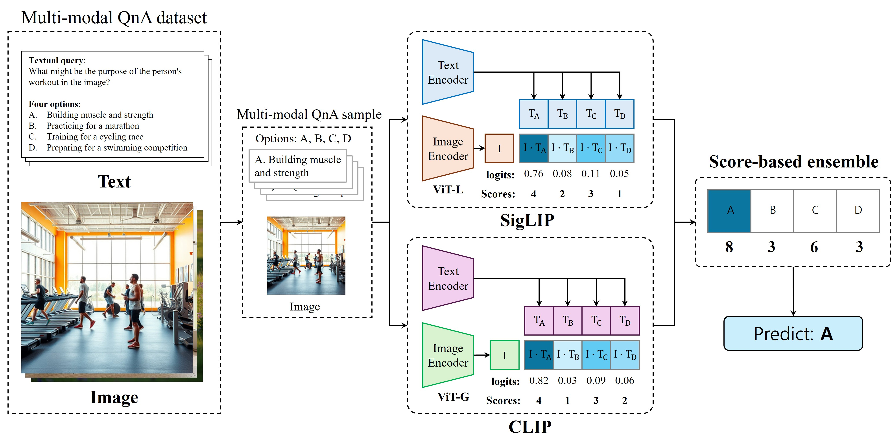

# 2025 Samsung Collegiate Programming Challenge: AI Challenge (Dacon)

Competition page: https://dacon.io/competitions/official/236500/overview/description

---

## 1. Introduction  

Recent advances in deep learning have significantly influenced many real-world applications. In particular, multimodal models capable of processing both images and text have enabled new possibilities for visual question answering and image–text understanding tasks.

In this project, we propose a **multimodal classification model** that selects the correct answer from four candidate options given an **image and a question**.

Our approach ensembles **CLIP** and **SigLIP** to compute similarity scores between image and text candidates. The final prediction is obtained by aggregating the scores from both models.

The proposed method achieved approximately **71% classification accuracy** on the dataset.

---

##  2. Related Work  
### 2.1. Multimodal Models

Multimodal models are designed to process **two or more modalities simultaneously**.

Examples include:

- **Dual Encoder**
  - CLIP
  - SigLIP

- **Encoder–Decoder**
  - T5

- **Decoder-only**
  - LLaMA

Dual-encoder models map images and text into a **shared embedding space**, allowing similarity to be computed between image and text representations.

---

## 3. Proposed Method  

### 3.1. Embedding  

#### CLIP

- Image encoder → \( e_i \in \mathbb{R}^d \)
- Text encoder → \( e_t^j \in \mathbb{R}^d \), where \( j \in \{A, B, C, D\} \)

#### SigLIP

SigLIP follows the same dual-encoder architecture as CLIP.

### 3.2. Similarity & Scoring

Similarity scores are computed using the **dot product between image and text embeddings**.

For both CLIP and SigLIP:

- Candidate options are ranked using `argsort`
- Scores are assigned as follows:
  - 1st place: 4 points
  - 2nd place: 3 points
  - 3rd place: 2 points
  - 4th place: 1 point

The scores from both models are aggregated to construct the final `score_dict`.

### 3.3. Ensemble Decision  

- The option with the **highest total score** is selected as the final answer.
- If multiple candidates share the same score, the option with the **higher CLIP score** is selected.

---

## 4. Experiments

### 4.1. Dataset

Each sample consists of:

- one image
- one question
- four candidate answers

Dataset link: https://dacon.io/competitions/official/236500/data

---

### 4.2. Evaluation Metric

- **Classification Accuracy**

---

### 4.3. Experimental Setting

- **Zero-shot evaluation**
- Pre-trained models are used **without additional fine-tuning**

---

### 4.4. Result

- Approximately **71% accuracy** on the test set.

---

## 5. Conclusion  

This project follows the SCPC competition constraints:

- Model size limited to **3B parameters**
- Only models released **before December 31, 2023** can be used

Despite these constraints, the proposed method achieved strong classification performance.

However, the current approach does not fully leverage the **semantic information contained in the question**, which limits its reasoning ability. Improving this aspect will be an interesting direction for future work.

---

##  Repository Structure  
1. Radford et al., Learning transferable visual models from natural language supervision, ICML 2021.
2. Zhai et al., Sigmoid loss for language image pre-training, ICCV 2023.

##  How to Run  

### 1. Requirements  
- OS: Windows 11  
- GPU: NVIDIA GeForce RTX 3080 Ti (CUDA 12.4)  
- Python: 3.11+  
- Libraries:  
  torch==2.5.0 torchvision==0.20.0 torchaudio==2.5.0
  transformers==4.54.1 pandas==2.2.3 pillow==11.0.0 tqdm==4.67.0 numpy==2.0.2

##  Sample Example  

### Input example

ID: TEST_000

Image:

Question: "What types of fruits are visible in the image?"

A: "Bananas and grapes placed in baskets"

B: "Apples and oranges displayed on the counter"

C: "Peaches and plums in a wooden crate"

D: "Pears and lemons arranged neatly"

