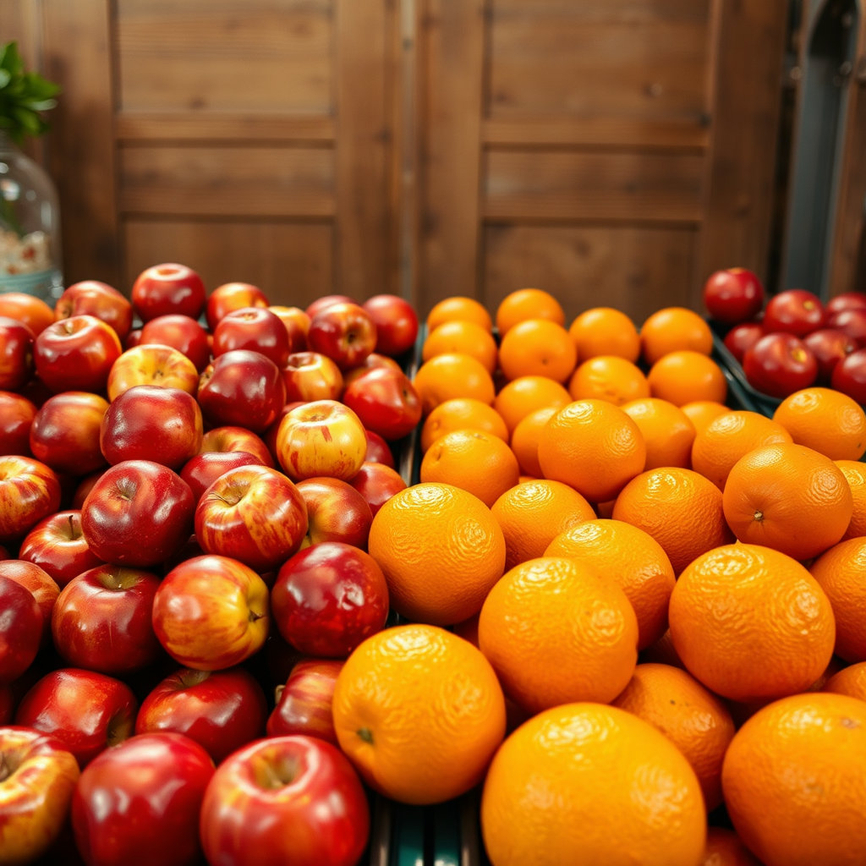

# 📌 2025 Samsung Collegiate Programming Challenge : AI 챌린지

데이콘 사이트: https://dacon.io/competitions/official/236500/overview/description

## 📝 Introduction  
딥러닝의 발달은 일상생활 전반에 걸쳐 큰 도움을 주고 있다. 특히 이미지와 텍스트와 같은 멀티모달 데이터를 동시에 처리할 수 있는 모델들이 등장하면서, 다양한 응용이 가능해졌다. 본 프로젝트에서는 **이미지와 질문이 주어졌을 때 4개의 보기 중 올바른 답을 선택하는 멀티모달 분류 모델**을 제안한다.  

제안 모델은 **CLIP**과 **SigLIP**을 앙상블하여, 보기별 점수(score)를 산출하고 이를 합산하여 최종 예측값을 결정한다. 본 접근법은 멀티모달 데이터셋에서 약 **71% 분류 정확도**를 보였다.

---

## 🔎 Related Work  
### 멀티모달 모델  
멀티모달 모델은 두 가지 이상의 모달리티(modality)를 동시에 처리할 수 있는 모델을 의미한다.  
- **Dual Encoder**: CLIP, SigLIP  
- **Encoder–Decoder**: T5  
- **Decoder-only**: LLaMA  

Dual Encoder 기반 모델은 이미지와 텍스트를 각각 임베딩 벡터로 변환하고, 동일한 잠재 공간(latent space)에 맵핑하여 유사도를 계산한다. 이를 통해 주어진 질의-응답(task)에 효과적으로 활용할 수 있다.

---

## ⚙️ Proposed Method  
### 1. Embedding  
- **CLIP**:  
  - 이미지 인코더 → \( e_i ∈ ℝ^d \)  
  - 텍스트 인코더 → 각 보기별 임베딩 \( e_t^j ∈ ℝ^d, j ∈ {A, B, C, D} \)  
- **SigLIP**: CLIP과 동일한 구조로 동작  

### 2. Similarity & Scoring  
- 이미지–텍스트 임베딩 벡터 간 내적을 통해 유사도 점수 계산  
- CLIP, SigLIP 각각에 대해 argsort 기반 점수 부여  
  - 1등: 4점, 2등: 3점, 3등: 2점, 4등: 1점  
- 두 모델의 점수를 합산하여 최종 score_dict 생성

### 3. Ensemble Decision  
- 최종 점수 중 argmax를 선택  
- 다수 후보 발생 시 CLIP 점수가 높은 보기를 최종 답변으로 선택

---

## 🧪 Experiments  
- **Dataset**: 각 샘플은 이미지 1장, 질문 문항, 보기 4개로 구성  https://dacon.io/competitions/official/236500/data
- **Evaluation Metric**: Classification Accuracy  
- **Setting**: Zero-shot (사전 학습된 모델 활용, 추가 파인튜닝 없음)  
- **Result**: Test set 기준 **약 71% 정확도**

---

## ✅ Conclusion  
본 프로젝트는 SCPC 경연대회의 조건(3B 파라미터 제한, 2023년 12월 31일 이전 공개 모델 사용)을 충족하면서도 우수한 분류 성능을 달성하였다. 다만, 현재 접근법은 질문 자체의 문맥 정보를 활용하지 않아 맥락 파악 능력이 제한적이라는 한계가 있다. 이는 추후 연구 과제로 삼을 예정이다.  

---

## 📂 Repository Structure  
1. Radford et al., Learning transferable visual models from natural language supervision, ICML 2021.
2. Zhai et al., Sigmoid loss for language image pre-training, ICCV 2023.

## 🚀 How to Run  

### 1. Requirements  
- OS: Windows 11  
- GPU: NVIDIA GeForce RTX 3080 Ti (CUDA 12.4)  
- Python: 3.11+  
- Libraries:  
  torch==2.5.0 torchvision==0.20.0 torchaudio==2.5.0
  transformers==4.54.1 pandas==2.2.3 pillow==11.0.0 tqdm==4.67.0 numpy==2.0.2

## 🧩 Sample Example  

### Input example

ID: TEST_000

Img:

Question: "What types of fruits are visible in the image?"
A: "Bananas and grapes placed in baskets"
B: "Apples and oranges displayed on the counter"
C: "Peaches and plums in a wooden crate"
D: "Pears and lemons arranged neatly"

